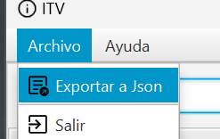
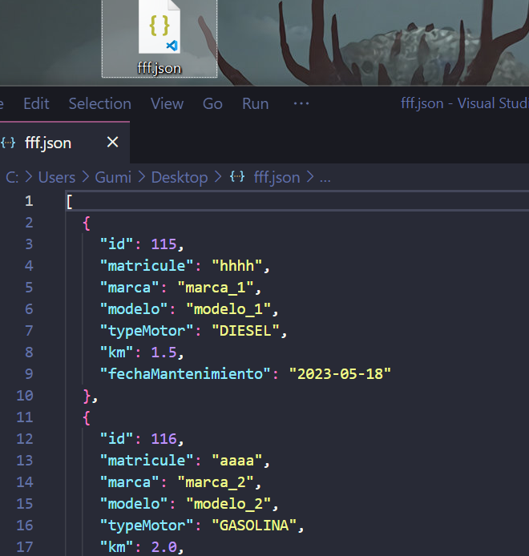
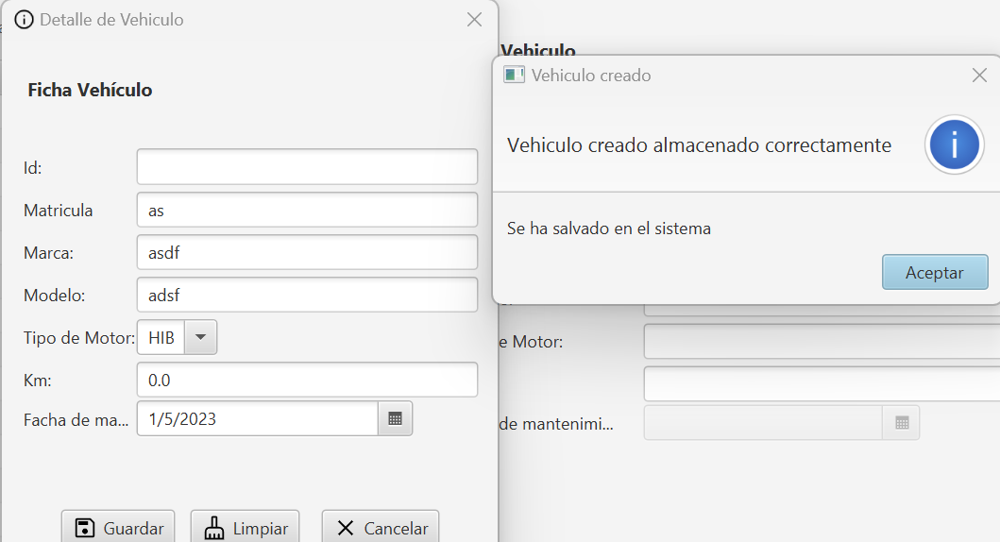
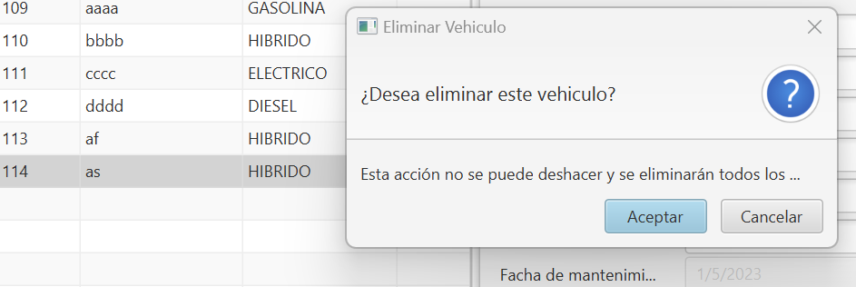
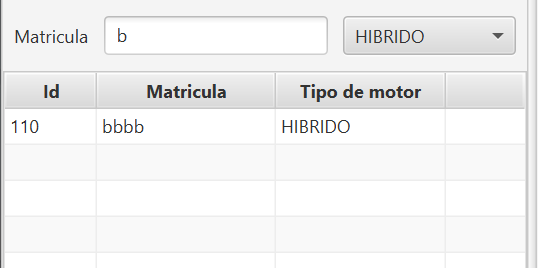
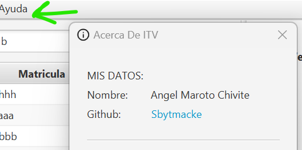

## **Vehiculos-Interfaz-CRUD:**

- [x] Arquitectura MVVM
- [x] Reactividad
- [x] Navegación filosofía Compose (Route)
- [x] Clases States
- [x] JavaFX
- [x] Koin
- [x] SQDelight
- [x] RailwayProgramming

---

## **Planteamiento realizado:**

- Dispongo de 3 vistas:

  1. La vista inicial donde se podrá:

  - Exportar mediante el menú superior todos los vehículos

  

  

  - Guardar y actualizar un vehículo

  

  

  - Eliminar un vehículo seleccionado de la interfaz

    

  - Filtrado por tipo de motor y búsqueda por matrícula

    

    

  2. La vista de "Acerca de" donde hay información relevante del desarrollador, se introduce en ella mediante el menú superior.

     

  3. Las vistas de Detalles que salen emergentes cuando actualizamos un vehículo (son las anteriores presentadas)

- La reactividad se ha empleado mediante `bind´s` unidireccionales y gracias al `DataState` donde almacenaba en este modelo aquelos items y propiedades que eran las cambiantes para que haya dicha reactividad.
