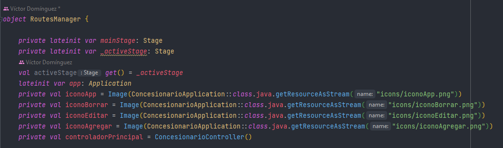
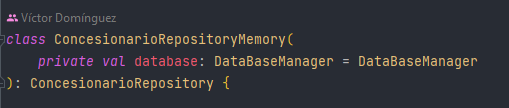
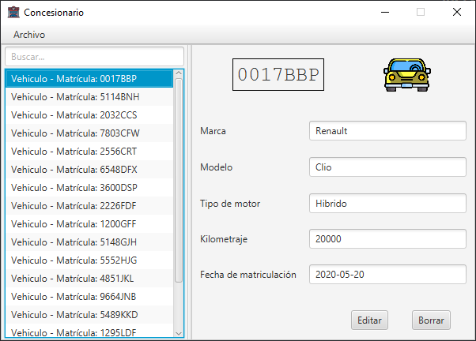
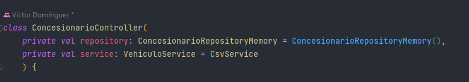
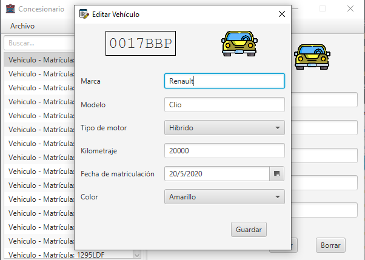
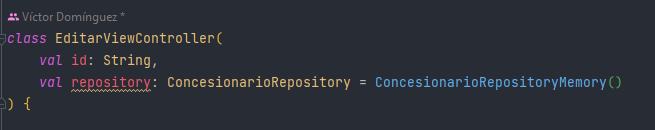
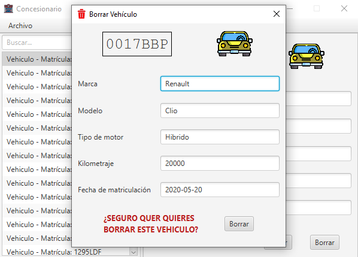
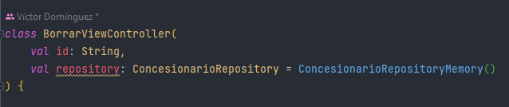
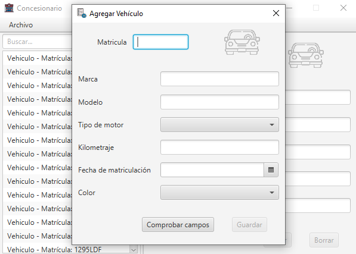
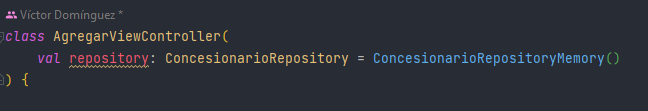

# VehiculosCrudInterface

### Routes Manager

RoutesManager se encarga de controlar las rutas entre los diferentes Stages.

### Repositorio

Gestiona las consultas de la base de datos y almacena y gestiona los vehículos

### Vista principal
La vista principal está dividida en dos zonas. En la zona de la izquierda tenemos un ListView
con vehículos en la base de datos y una barra de búsqueda. En la zona derecha tenemos la
información del vehículo seleccionado y dos botones "Editar" y "Borrar".

La lista de vehículos (ListView) tiene un "listener" que reacciona cuando se selecciona un
coche para así mostrar la información en la pantalla derecha.

> Controlador de la vista:

### Vista Editar

En la vista editar podremos editar los campos de un vehículo existente en la base de datos 
(menos la matrícula). Para el tipo de motor y los colores he usado un ChoiceBox y para la 
fecha un DatePicker. Al guardar se validan los datos introducidos.

> Controlador de la vista:

### Vista Borrar

En la vista borrar nos aparecerán los datos del vehículo. Tendremos que pulsar el botón
borrar y confirmar nuestra acción en una alerta de confirmación.

> Controlador de la vista:

### Vista Agregar

En la vista agregar tendremos una ficha vacía para rellenar con los campos del nuevo
vehículo a añadir. Tendremos que comprobar los datos y una vez validados se habilita el 
botón Guardar.

> Controlador de la vista:
