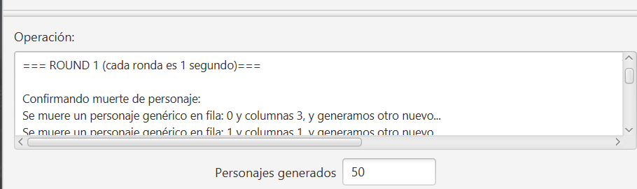
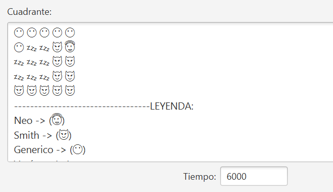
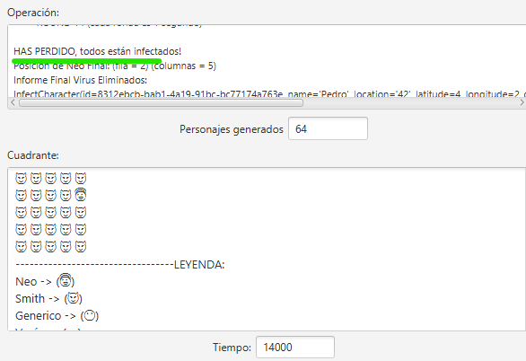

## **Matrix-Simulation-Interfaz:**

- [x] Arquitectura MVVM
- [x] Reactividad
- [x] Navegación filosofía Compose (Route)
- [x] Clases States
- [x] JavaFX
- [x] Koin
- [x] Thread & Platform.runLater
- [x] SonaLint
- [ ] RailwayProgramming

---

## **Planteamiento realizado:**

- Dispongo de 2 vistas:

  1. La vista inicial donde se podrá comenzar la simulación:

  - Se informará de lo que ocurre en la simulación mediante el `Panel Operacion`:

  

  - Se informará de lo que ocurre en la simulación mediante el `Panel Ccuadrante`:

  

  - Al final de la simulación nos dará un breve informe de los resultados:

  

  2. La vista de "Acerca de" donde hay información relevante del desarrollador, se introduce en ella mediante el menú superior.

- La reactividad se ha empleado mediante `bind´s` unidireccionales y gracias al `SimualtionState` donde almaceno en este modelo los items y propiedades que son las cambiantes para que haya dicha reactividad en la interfaz.
